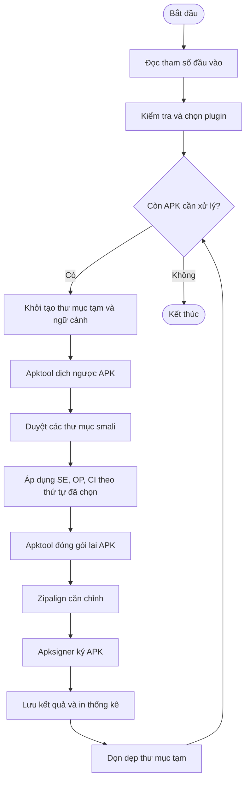
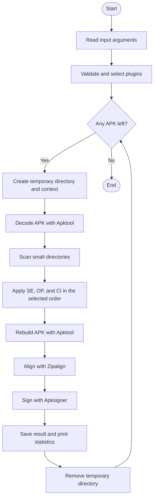

# APK Obfuscator

**Tiếng Việt** | [English below](#english-version)

> Công cụ làm rối hộp đen dành cho tệp Android APK, được xây dựng theo kiến trúc plugin phục vụ học tập và nghiên cứu an toàn thông tin.

APK Obfuscator nhận một hoặc nhiều tệp APK đã biên dịch, chuyển mã về dạng smali, áp dụng các phép biến đổi được chọn rồi đóng gói và ký lại APK. Người dùng không cần mã nguồn Java/Kotlin ban đầu.

Dự án tập trung vào việc khảo sát ảnh hưởng của làm rối mã đối với phân tích tĩnh và các mô hình học máy phát hiện mã độc Android. Phiên bản hiện tại cung cấp ba kỹ thuật: mã hóa chuỗi, chèn điều kiện giả và gọi hàm gián tiếp.

## Mục lục

- [Tính năng](#tính-năng)
- [Yêu cầu](#yêu-cầu)
- [Cài đặt](#cài-đặt)
- [Cách sử dụng](#cách-sử-dụng)
- [Cơ chế hoạt động](#cơ-chế-hoạt-động) 
- [Sơ đồ luồng thực thi](#sơ-đồ-luồng-thực-thi)
- [Kết quả thực nghiệm](#kết-quả-thực-nghiệm)
- [Giới hạn hiện tại](#giới-hạn-hiện-tại)
- [Miễn trừ trách nhiệm](#miễn-trừ-trách-nhiệm)
- [Lời cảm ơn](#lời-cảm-ơn)

## Tính năng

| Mã | Plugin | Mô tả |
| --- | --- | --- |
| `SE` | String Encryption | Mã hóa các chuỗi smali phù hợp bằng Base64 và chèn logic giải mã lúc chạy. Các chuỗi nhạy cảm với quá trình biên dịch như tên lớp, tên gói hệ thống và tham chiếu tài nguyên được bỏ qua. |
| `OP` | Opaque Predicate | Chèn các điều kiện có kết quả biết trước, nhánh chết và nhãn trung gian để làm phức tạp luồng điều khiển mà không chủ ý thay đổi hành vi gốc. |
| `CI` | Call Indirection | Thay một số lời gọi API trực tiếp bằng lời gọi tới lớp bao trung gian được sinh tự động, qua đó làm thay đổi cấu trúc đồ thị gọi hàm. |

Ngoài ra, công cụ hỗ trợ:

- Xử lý hàng loạt toàn bộ tệp `.apk` trong một thư mục.
- Kết hợp nhiều plugin trong cùng một lần chạy.
- Duyệt tất cả thư mục smali, bao gồm các APK có nhiều tệp DEX.
- Tự động đóng gói, căn chỉnh và ký lại APK đầu ra.
- Bỏ qua phương thức hoặc câu lệnh không an toàn thay vì làm hỏng toàn bộ quá trình.
- Thống kê số tệp smali, phương thức, khối điều kiện giả, lời gọi được bao và lớp hỗ trợ đã tạo.
- Tự động dọn dẹp thư mục tạm sau mỗi APK.

## Yêu cầu

- Python 3.8 trở lên. Phần lõi chỉ sử dụng thư viện chuẩn của Python.
- Java Development Kit (JDK), cung cấp lệnh `keytool`.
- [Apktool](https://apktool.org/) để dịch ngược và đóng gói lại APK.
- Android SDK Build Tools, cung cấp `zipalign` và `apksigner`.

Các lệnh sau phải có trong biến môi trường `PATH`:

```bash
python --version
java -version
keytool -help
apktool --version
zipalign -h
apksigner version
```

## Cài đặt

```bash
git clone https://github.com/VuHai-Sec/APK_obfuscator.git
cd APK_obfuscator
```

Đặt các APK cần xử lý vào một thư mục riêng, ví dụ:

```text
APK_obfuscator/
├── samples/
│   ├── sample_01.apk
│   └── sample_02.apk
└── obfuscator.py
```

## Cách sử dụng

Cú pháp:

```bash
python obfuscator.py -i <thư_mục_đầu_vào> [-o <thư_mục_đầu_ra>] -a <plugin...>
```

Ví dụ áp dụng cả ba plugin:

```bash
python obfuscator.py -i ./samples -o ./output -a SE OP CI
```

Chỉ dùng mã hóa chuỗi và điều kiện giả:

```bash
python obfuscator.py -i ./samples -o ./output -a SE OP
```

| Tham số | Bắt buộc | Ý nghĩa |
| --- | --- | --- |
| `-i`, `--input` | Có | Thư mục chứa các APK đầu vào. |
| `-o`, `--output` | Không | Thư mục lưu kết quả; mặc định là `./obfuscated_malwares`. |
| `-a`, `--algorithms` | Có | Một hoặc nhiều mã plugin: `SE`, `OP`, `CI`. |

Mỗi kết quả có tên `obfuscated_<tên_tệp_gốc>.apk`. Nếu chưa có `debug.keystore`, công cụ sẽ tạo khóa gỡ lỗi với thông tin mặc định của Android để ký APK. Khóa này chỉ phù hợp cho thử nghiệm, không dùng để phát hành ứng dụng thực tế.

## Cơ chế hoạt động

1. `obfuscator.py` đọc tham số, xác thực danh sách plugin và duyệt các APK đầu vào.
2. `CoreManager.py` tạo ngữ cảnh xử lý, sau đó gọi Apktool để dịch ngược APK.
3. Công cụ tìm các tệp `.smali` trong `smali`, `smali_classes2`, ... và chuyển từng tệp qua các plugin theo đúng thứ tự người dùng cung cấp.
4. `SmaliUtils.py` nhận diện phương thức, thanh ghi và các vị trí có thể biến đổi an toàn. Các plugin giữ nguyên phương thức không đáp ứng điều kiện an toàn.
5. Sau biến đổi, Apktool đóng gói lại APK; `zipalign` căn chỉnh tệp và `apksigner` ký kết quả.
6. Công cụ in thống kê, xóa thư mục tạm và tiếp tục với APK kế tiếp.

### Mã hóa chuỗi (`SE`)

Plugin tìm lệnh `const-string`/`const-string-jumbo`, mã hóa giá trị bằng Base64 và thay lệnh gốc bằng chuỗi lệnh giải mã qua `android.util.Base64` tại thời điểm chạy. Mỗi phương thức được cấp thêm ba thanh ghi tạm khi đủ điều kiện.

### Điều kiện giả (`OP`)

Plugin lựa chọn ổn định một trong bốn mẫu dựa trên định danh phương thức: bất biến số học, độ dài chuỗi, so sánh lớp hoặc độ dài mảng. Khối lệnh được chèn tại vị trí an toàn.

### Gọi hàm gián tiếp (`CI`)

Plugin phát hiện một số lời gọi `invoke-virtual` được hỗ trợ, tạo lớp `com/obf/W*` với phương thức `wrap`, rồi thay lời gọi trực tiếp bằng `invoke-static` tới lớp này. Lớp bao được tái sử dụng cho các lời gọi có cùng chữ ký.

## Sơ đồ luồng thực thi

Mã nguồn sơ đồ được lưu tại [`sơ đồ luồng.mmd`](./s%C6%A1%20%C4%91%E1%BB%93%20lu%E1%BB%93ng.mmd).



## Kết quả thực nghiệm

Công cụ được đánh giá với cấu hình kết hợp `OP CI SE` trên mô hình [MalScan](https://github.com/malscan-android/MalScan), sử dụng Random Forest và đặc trưng Katz. Trong tập đánh giá, cả thư mục gốc và thư mục sau làm rối đều đạt tỷ lệ xử lý thành công 100%.

| Chỉ số MalScan | Tệp gốc | Tệp làm rối | Thay đổi |
| --- | ---: | ---: | ---: |
| F1 Score | 0,763566 | 0,760000 | -0,003566 |
| Precision | 0,617555 | 0,630102 | +0,012547 |
| Recall | 1,000000 | 0,957364 | -0,042636 |
| Accuracy | 0,692695 | 0,675000 | -0,017695 |
| TPR | 1,000000 | 0,957364 | -0,042636 |
| FNR | 0,000000 | 0,042636 | +0,042636 |


Trong phép thử riêng trên năm mẫu malware, xác suất dự đoán malware giảm ở bốn mẫu sau làm rối; một mẫu đổi nhãn từ `malware` sang `benign`.


Kết quả cho thấy các phép biến đổi tương thích với tập APK thử nghiệm và có thể làm suy giảm khả năng nhận diện của MalScan. 

## Giới hạn hiện tại

- Khả năng nhận diện của MalScan đã giảm, song mức giảm còn khiêm tốn, và chưa đảm bảo vượt qua mọi hệ thống phát hiện.
- Đối với các phương thức có cấu trúc phức tạp (annotation, payload), hoặc thuộc loại `native`/`abstract` có thể được bỏ qua để bảo toàn khả năng đóng gói.
- `SE` sử dụng phép mã hoá Base64 để mang tính demo dự án, chưa phải mã hóa mật mã.
- APK đầu ra được ký bằng khóa gỡ lỗi và không giữ chữ ký gốc.

## Miễn trừ trách nhiệm

Dự án được cung cấp **chỉ cho mục đích giáo dục, nghiên cứu phòng thủ và kiểm thử có ủy quyền**. Chỉ sử dụng công cụ với ứng dụng do bạn sở hữu hoặc đã được chủ sở hữu cho phép rõ ràng.

Tác giả và những người đóng góp không chịu trách nhiệm cho việc lạm dụng công cụ, thiệt hại, mất dữ liệu hoặc hành vi vi phạm pháp luật phát sinh từ dự án. Người sử dụng có trách nhiệm tuân thủ pháp luật, quy định của tổ chức và nguyên tắc công bố có trách nhiệm. Không tải mẫu độc lên thiết bị, dịch vụ hoặc hệ thống bên thứ ba khi chưa có sự cho phép; nên tiến hành thử nghiệm trong môi trường cô lập.

## Lời cảm ơn

Dự án được thực hiện bởi:

- Trần Thị Vân Ngọc ([@gemmychen1406](https://github.com/gemmychen1406)) — thiết kế, xây dựng công cụ làm rối Android.
- Vũ Trường Hải ([@VuHai-Sec](https://github.com/VuHai-Sec)) — nghiên cứu công cụ liên quan và đánh giá hiệu quả với MalScan.

Xin cảm ơn ThS. Vũ Minh Mạnh đã hướng dẫn đề tài; đồng thời cảm ơn các dự án và tài nguyên mã nguồn mở đã hỗ trợ quá trình nghiên cứu:

- [Apktool](https://apktool.org/) — dịch ngược và đóng gói APK.
- [Android SDK Build Tools](https://developer.android.com/tools/releases/build-tools) — căn chỉnh và ký APK.
- [MalScan](https://github.com/malscan-android/MalScan) — mô hình đánh giá phát hiện mã độc Android.
- [CICMalDroid 2020](https://www.unb.ca/cic/datasets/maldroid-2020.html) và [F-Droid](https://f-droid.org/) — nguồn dữ liệu phục vụ thực nghiệm.

---

Nếu dự án hữu ích cho nghiên cứu của bạn, hãy tặng 1 sao cho repository.

---

# English Version

[Tiếng Việt](#apk-obfuscator) | **English**

> A black-box obfuscation tool for Android APK files, built with a plugin-based architecture for educational and cybersecurity research purposes.

APK Obfuscator takes one or more compiled APK files, converts their code into smali, applies the selected transformations, then rebuilds and signs the resulting APKs. The original Java/Kotlin source code is not required.

This project investigates the effects of code obfuscation on static analysis and machine-learning-based Android malware detection. The current version provides three techniques: string encoding, opaque predicate insertion, and call indirection.

## Table of Contents

- [Features](#features)
- [Requirements](#requirements)
- [Installation](#installation)
- [Usage](#usage)
- [How It Works](#how-it-works)
- [Execution Flow](#execution-flow)
- [Experimental Results](#experimental-results)
- [Current Limitations](#current-limitations)
- [Disclaimer](#disclaimer)
- [Acknowledgements](#acknowledgements)

## Features

| Code | Plugin | Description |
| --- | --- | --- |
| `SE` | String Encryption | Encodes suitable smali strings with Base64 and inserts runtime decoding logic. Strings that may affect compilation, such as class names, system packages, and resource references, are skipped. |
| `OP` | Opaque Predicate | Inserts predicates with predetermined results, dead branches, and intermediate labels to complicate control flow without intentionally changing the original behavior. |
| `CI` | Call Indirection | Replaces selected direct API calls with calls to automatically generated wrapper classes, modifying the structure of the call graph. |

Additional capabilities include:

- Batch processing of every `.apk` file in an input directory.
- Combining multiple plugins in a single run.
- Scanning all smali directories, including APKs with multiple DEX files.
- Automatically rebuilding, aligning, and signing output APKs.
- Skipping unsafe methods or instructions instead of terminating the entire process.
- Reporting statistics for scanned smali files, methods, inserted opaque blocks, wrapped calls, and generated helper classes.
- Automatically removing temporary directories after each APK is processed.

## Requirements

- Python 3.8 or later. The core obfuscator only uses the Python standard library.
- Java Development Kit (JDK), which provides `keytool`.
- [Apktool](https://apktool.org/) for decoding and rebuilding APK files.
- Android SDK Build Tools, which provide `zipalign` and `apksigner`.

The following commands must be available through the system `PATH`:

```bash
python --version
java -version
keytool -help
apktool --version
zipalign -h
apksigner version
```

> `crawl_Fdroid.py` is a separate data collection utility that additionally requires the `requests` package. It is not required to run the obfuscator.

## Installation

```bash
git clone https://github.com/VuHai-Sec/APK_obfuscator.git
cd APK_obfuscator
```

Place the APK files to be processed in a separate directory, for example:

```text
APK_obfuscator/
├── samples/
│   ├── sample_01.apk
│   └── sample_02.apk
└── obfuscator.py
```

## Usage

Syntax:

```bash
python obfuscator.py -i <input_directory> [-o <output_directory>] -a <plugins...>
```

Apply all three plugins:

```bash
python obfuscator.py -i ./samples -o ./output -a SE OP CI
```

Apply only string encoding and opaque predicates:

```bash
python obfuscator.py -i ./samples -o ./output -a SE OP
```

| Argument | Required | Description |
| --- | --- | --- |
| `-i`, `--input` | Yes | Directory containing input APK files. |
| `-o`, `--output` | No | Output directory; defaults to `./obfuscated_malwares`. |
| `-a`, `--algorithms` | Yes | One or more plugin codes: `SE`, `OP`, `CI`. |

Each result is named `obfuscated_<original_filename>.apk`. If `debug.keystore` does not exist, the tool creates a debug key using Android's default debug credentials. This key is intended for testing only and must not be used to publish production applications.

## How It Works

1. `obfuscator.py` reads the command-line arguments, validates the plugin list, and iterates through the input APKs.
2. `CoreManager.py` creates the processing context and invokes Apktool to decode each APK.
3. The tool locates `.smali` files under `smali`, `smali_classes2`, and other smali directories, then passes every file through the plugins in the order provided by the user.
4. `SmaliUtils.py` identifies methods, registers, and safe transformation positions. Methods that do not meet the safety conditions are left unchanged.
5. Apktool rebuilds the transformed APK, `zipalign` aligns it, and `apksigner` signs the result.
6. The tool prints a summary, removes the temporary directory, and continues with the next APK.

### String Encryption (`SE`)

The plugin finds `const-string` and `const-string/jumbo` instructions, encodes suitable values with Base64, and replaces the original instruction with runtime decoding logic through `android.util.Base64`. Three additional temporary registers are allocated when the method can be safely transformed.

### Opaque Predicate (`OP`)

The plugin deterministically selects one of four templates based on the method identifier: an arithmetic invariant, string-length invariant, class-comparison invariant, or array-length invariant. The generated block is inserted at a safe location near the beginning of the method.

### Call Indirection (`CI`)

The plugin detects selected supported `invoke-virtual` calls, generates a `com/obf/W*` helper class with a `wrap` method, and replaces the direct call with an `invoke-static` call to that wrapper. Wrappers are reused for calls with matching signatures.

## Execution Flow

The Mermaid source is available in [`sơ đồ luồng.mmd`](./s%C6%A1%20%C4%91%E1%BB%93%20lu%E1%BB%93ng.mmd).



## Experimental Results

The tool was evaluated using the combined `OP CI SE` configuration against [MalScan](https://github.com/malscan-android/MalScan), with Random Forest and Katz centrality features. Both the original and obfuscated evaluation directories achieved a 100% processing success rate.

| MalScan metric | Original APKs | Obfuscated APKs | Change |
| --- | ---: | ---: | ---: |
| F1 Score | 0.763566 | 0.760000 | -0.003566 |
| Precision | 0.617555 | 0.630102 | +0.012547 |
| Recall | 1.000000 | 0.957364 | -0.042636 |
| Accuracy | 0.692695 | 0.675000 | -0.017695 |
| TPR | 1.000000 | 0.957364 | -0.042636 |
| FNR | 0.000000 | 0.042636 | +0.042636 |


In a separate experiment on five malware samples, the predicted malware probability decreased for four samples after obfuscation, and one sample changed its predicted label from `malware` to `benign`.


These results indicate that the transformations were compatible with the evaluated APK set and could reduce MalScan's detection performance.

## Current Limitations

- MalScan's detection performance decreased, but the reduction remains modest and does not guarantee evasion of every detection system.
- Methods with complex structures, such as annotations or payloads, and `native`/`abstract` methods may be skipped to preserve rebuild compatibility.
- `SE` uses Base64 encoding for demonstration purposes; it does not provide cryptographic encryption.
- Output APKs are signed with a debug key and do not retain the original signature.

## Disclaimer

This project is provided **solely for educational purposes, defensive research, and authorized testing**. Only use it on applications that you own or for which you have received explicit permission from the owner.

The authors and contributors are not responsible for misuse, damage, data loss, or unlawful activity arising from this project. Users are responsible for complying with applicable laws, organizational policies, and responsible disclosure principles. Do not upload malware samples to third-party devices, services, or systems without authorization. Testing should be performed in an isolated environment.

## Acknowledgements

This project was developed by:

- Trần Thị Vân Ngọc ([@gemmychen1406](https://github.com/gemmychen1406)) — designed and implemented the Android obfuscation tool.
- Vũ Trường Hải ([@VuHai-Sec](https://github.com/VuHai-Sec)) — researched related tools and evaluated the project against MalScan.

We thank M.Sc. Vũ Minh Mạnh for supervising this project. We also acknowledge the open-source projects and resources that supported this research:

- [Apktool](https://apktool.org/) — APK decoding and rebuilding.
- [Android SDK Build Tools](https://developer.android.com/tools/releases/build-tools) — APK alignment and signing.
- [MalScan](https://github.com/malscan-android/MalScan) — the Android malware detection model used for evaluation.
- [CICMalDroid 2020](https://www.unb.ca/cic/datasets/maldroid-2020.html) and [F-Droid](https://f-droid.org/) — data sources used in the experiments.

---

If this project is useful to your research, please consider giving the repository a star.
